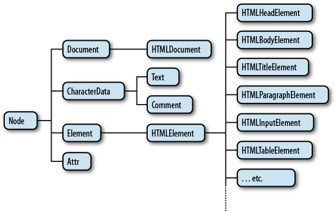
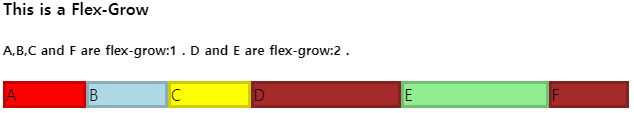

# 20201127 Quiz

***HTTP(HyperText Transfer Protocol) PROTOCOL***

→ 기본적으로 프로토콜이란 특정 기기가 서로 데이터를 주고 받기 위해 정해놓은 일종의 규약입니다. SMTP, FTP 등 목적에 맞게 다양하게 존재 ***ex)*** ***이렇게 줄테니까 이렇게 받아!*** 

1. Stateless : 연결을  끊는 Connectless의 특성 상 각 요청에 독립적이지만 클라이언트의 이전 상태를 알 수 없다. 따라서 HTTP는 Cookie를 이용해서 이 문제를 해결한다.
2. Connectless : 브라우저는 서버에 연결하고 요청 후 응답을 받으면 연결을 끊는다.

- 서버에게 브라우저가 데이터를 요청할 때에는 HTTP Request, 응답받을 때에는 HTTP Response
- HTTP Method → 요청의 종류를 서버에게 알려주기 위해 사용하며 목적별로 메소드가 존재한다.
    1. GET : 데이터를 요청하기 위해 사용한다.
    2. POST : 데이터를 삽입하기 위해 사용한다.
    3. PUT : 데이터를 갱신하기 위해 사용한다.
    4. DELETE : 데이터를 삭제하기 위해 사용한다.
    5. HEAD : 서버 헤더 정보를 획득, GET과 비슷하나 Response Body를 반환하지 않음
    6. OPTIONS : 서버 옵션들을 확인하기 위한 요청. CORS에서 사용

- HTTP 상태 코드

    2xx → 성공

    ***200*** : GET 요청 성공

    ***204*** : No Content, 요청은 성공했으나 응답 본문에 데이터 X

    ***205*** : Reset Content, 성공했으나 클라이언트의 화면을 새로 고침하도록 권고

    ***206*** : Partial Content, 성공했으나 일부 범위의 데이터만 반환

    3xx → Redirection

    ***301*** : Moved permanently, 요청한 자원이 새 URL 에 존재

    ***303*** : See Other, 요청한 자원이 임시 주소에 존재

    ***304*** : Not Modified, 요청한 자원이 변경되지 않았으므로 클라이언트의 캐싱된 자원을 사용하자!

    4xx → Client Error

    ***400*** : Bad Request, 잘못된 요청

    ***401*** :  Unauthorized, 권한없이 요청한 경우 (Authorization 헤더가 잘못된 경우)

    ***403*** : Forbidden, 서버에서 해당 자원에 대해 접근 금지

    ***405*** : Method Not Allowed, 허용되지 않은 요청 메서드

    ***409*** : Conflict, 최신 자원이 아닌데 업데이트하는 경우 ex) 파일 업로드 시 버전 충돌

    5 xx → Server Error

    ***501*** : Not Implemented, 요청한 동작에 대해 서버가 수행할 수 없는 경우

    ***503*** : Service Unavailable, 서버가 과부하 또는 유지 보수로 내려간 경우 

---

## *Document Type Definition*

→ HTML 문서 최상단에 나오는 !DOCTYPE으로 시작하는 태그로써 ***해당 HTML 문서가 어떤 문서형식을 따를 것인지를 명시하는 부분***이다. 

---

## *정규식 (Regular Expressions)*

→ ***특정 검색 패턴*** 에 대한 하나 이상의 일치 항목을 검색하여 텍스트에서 정보를 추출하는데에 사용되는 것

[https://chrisjune-13837.medium.com/정규식-튜토리얼-예제를-통한-cheatsheet-번역-61c3099cdca8](https://chrisjune-13837.medium.com/%EC%A0%95%EA%B7%9C%EC%8B%9D-%ED%8A%9C%ED%86%A0%EB%A6%AC%EC%96%BC-%EC%98%88%EC%A0%9C%EB%A5%BC-%ED%86%B5%ED%95%9C-cheatsheet-%EB%B2%88%EC%97%AD-61c3099cdca8)

---

## *Box Model*

→ *브라우저의 렌더링 엔진이 문서의 레이아웃을 계산할 때  표준 CSS 기본 박스 모델에 따라 각각의 요소를 **사각형 박스**로 표현한다.*

1. Margin : 바깥 여백 영역으로써 다른 태그와의 거리를 의미한다. 여러 개의 블록이 존재할 때에 시각적인 요소의 존재 여부에 따라 위 혹은 아래쪽 여백은 가장 큰 여백의 크기로 결합되는 경우가 있다.
2. Padding : 안쪽 여백 경계가 감싼 영역으로 크기는 안쪽 여백 박스너비와 안쪽 여백 박스 높이이다.
3. Border : 테두리 경계가 감싼 영역으로 안쪽 여백 영역을 요소의 테두리까지 포함하는 크기로 확장한다. 
4. Content : 컨텐츠 경계가 감싼 영역, 글 & 이미지 등 실제 내용을 포함하는 영역

---

## *Flex*

*→ Layout을 잡을 때 사용하며, **화면(그리드)을 적절하게 배분하여 사용**할 수 있도록 도와준다.*

- flex-basis : 해당 속성이 갖는 최소 넓이
- flex-grow

    

- flex-shrink : flex-grow와 반대

---

## *Media Query*

*→ **단말기의 유형과 어떤 특성이나 수치에 따라 웹사이트나 앱의 스타일을 수정**할 때 사용한다.* 

1. 미디어 유형과 자유로운 수의 미디어 특성 표현식으로 이루어지며, 논리 연산자를 사용해 다수의 쿼리를 다양하게 결합할 수 있다.
2. Level 3까지는 not 연산자들 통해 단일 기능 부정이 불가능했으나 Level 4부터는 가능해졌다.
3. *@media* 키워드를 통해 장치들을 특정할 수 있다.

---

## *CSS Methods*

- **Selector**

    → A * : 모든 A 선택 

    → A + B : A 와 바로 옆 형제인 B 태그

    → A ~ B : A와 형제인 모든 B 태그

    → A > B : 직계 자손 중 B 태그

- **Pseudo Class Selector**

    → :hover , :visited , :checked , :disabled , :first , :first-child , :focus , :last-child , :nth-child()

- **@media query**

    → 유형 : all, print, screen, speech

    → max width, min width

---

## *Javascript & jQuery*

*→ HTML을 동적으로 구현(웹 브라우저를 제어)하기 위한 언어이다. 웹 브라우저의 구성 요소들은 하나하나 객체화가 되어 있다. **JS는 이 객체들을 특정하고 제어하는 것을 통해 웹 브라우저를 제어**한다.* 

*브라우저의 렌더링 엔진은 웹 문서를 로드, 파싱하여 브라우저가 이해할 수 있는 구조로 구성한 뒤 메모리에 적재한다. 즉, 브라우저가 해독가능한 웹 문서를 Document Object Model 이라고 한다.*

- *Object Model*

    1.  *BOM(Browser Obejct Model)* : 브라우저에 대한 모든 내용을 담고있는 객체로써 뒤로가기, 북마크, 즐겨찾기, 히스토리 등 

    *2. DOM (Document Object Model)* : BOM 중 하나로 문서에 대한 모든 내용을 담고있는 객체로써 Document에 관련된 내용 모두를 객체화하여 관리할 수 있는 장점이 있다. 열러진 페이지에 대한 정보를 객체화시킨다.

    

    *→ Node 객체는 DOM의 시조 격으로 하위 모든 element 들은 Node를 상속받는다. 
    이 중 JS 에서는 Document, HTMLDocument를 통해 객체들을 조작한다.*

- Event Capturing, Event Bubbling

    *→ 중첩된 HTML 태그 간 이벤트가 발생 시 브라우저의 이벤트 전달 특성 (브라우저는 이벤트가 발생 시 해당 이벤트를 인지하고 해당 이벤트를 최상위에 있는 화면 요소까지 이벤트를 전파한다.) 때문에 **특정 태그에서 발생된 이벤트때문에** **다른 이벤트들까지 실행되는 현상**을 의미한다.* 

    1. Event Capturing : 이벤트가 최상단에서 발생한 곳까지 전달되며 지나가는 모든 이벤트가 실행되는 현상
    2. Event Bubbling : 이벤트가 안쪽에서 최상단으로 전달되며 지나가는 모든 이벤트가 실행되는 현상

    *만약 이런 것은 신경쓰고싶지 않고 그냥 둘다 안하고 싶다! → stopPropagation()*

- Ajax (Asynchronous javascript and XML)

    *→ 비동기적으로 Javascript를 이용해서 서버와 통신하는 기술*

- JSON(Javascript Object Notation)

    *→ Javascript 에서 객체를 만들 때 사용하는 표현식으로 최근 XML을 대체하기 시작했다.* 

    - **Javascript Methods**

        ***Selector, Window***

        → class. {} , #id {}, tagName {}

        → alert(), confirm(), prompt()

        → location.toString(), location.href(), location.reload()

        → console.dir(navigator.appname), navigator.appVersion, navigator.userAgent

        → window.open(),

        ---

        ***DOM***

        → document.getElementByTagName, getElementByClassName, getElementById

        get 함수가 단일 객체를 반환하는 경우 return type : HTMLElement

        get 함수가 다중 객체를 반환하는 경우 return type : HTMLCollection

---

## *Server*

- Routing → 전용회선을 통해 LAN에 연결
- *NAT (Network Address Translation) → WAN 과 LAN 사이에서 쌍방간의 요청을 처리*
- DHCP (Dynamic Host Configuration Protocol) → 호소트에게 IP 데이터들 자동으로 일정 시건 할당해주는 프로토콜
- Subnet → IP를 사용하는 네트워크 장치 수에 따라 효율적으로 사용할 수 있게 한다.

---

## *Linux*

- cd, locate, find, whereis, $PATH
- ps, top, htop
- daemon
- service

---

## *SQL*

- *Join*

    → Left outer : A + (A ∩ B)

    → Right outer : B + (A ∩ B) 

    → Full outer : A + B 

    → Inner : A ∩ B

    → Exclusive : A - (A ∩ B) / B - (A ∩ B)

---

## ***모르는 부분***

1.
