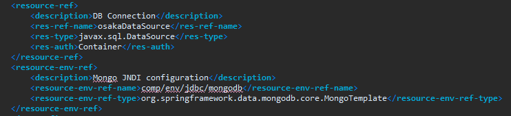

# DBCP

→  Connection 객체의 리소스 낭비를 방지하기 위해 사용하는 기술로써,  WAS 단에서 Web Application이 서비스되기 전에  Connection 객체를 미리 생성하여 사용하는 기술이다.

### Context.xml

### Web.xml

Connection Pool은 서버에서 관리하는 자원이기 때문에 Server 파일 내의 XML 파일을 통해 관리한다. 위 사진은 어떤 DBCP를 사용할 것인지 이에 대한 cofiguration을 작성한 것이다.

→ 사용 절차는 다음과 같다

1.  [JNDI Server](https://velog.io/@ette9844/JNDI-JNDI%EC%97%90-%EB%8C%80%ED%95%98%EC%97%AC) 에서 lookup() 메소드를 통해 DataSource 객체 획득
2. 획득한 객체의 getConnection()을 통해 Free 상태의 Connection 객체 획득
3. DBMS 작업 수행
4. 작업 완료 후 Connection Pool에게 Connection 객체 반납
