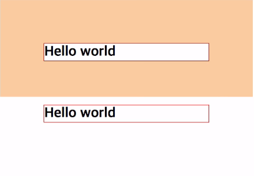
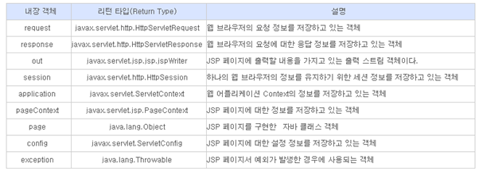
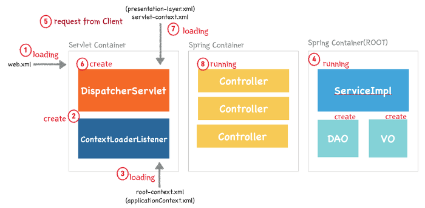

# 기술 Q&A

당연시되는 아주 기본적인 내용들은 대부분 생략했습니다. 또한 가로선 하단 부분과 초록색 마킹 부분은 추가적으로 알면 좋은 사항들이니 관심 있으신 분들은 공부해보셔도 좋을 것 같습니다.

## *JAVA*

- OOP → 추상화, 상속, 다형성(설명하면서 오버라이딩, 오버로딩으로 자연스럽게, 추상 클래스와 인터페이스의 차이), 캡슐화
- Compile, Java ByteCode, JVM → JVM 구성요소(Class Loader, Garbage Collector, Execution Engine), "write once, run everywhere"의 의미란?
- Static, final

    *static에 대한 여담을 하자면 교육센터 첫 프로젝트에서 강사님에게 받은 프로젝트 샘플을 살펴보다 비즈니스 로직의 거의 대부분 메소드가 static 선언이 되어있는 걸 확인한 적이 있다. 처음 Java를 배울 때 Main method에서 메소드를 사용하려다보니 (왜 Main method가 static인지는 찾아보면 나오고 아주 간단한 이유) 당연스럽게 static 선언을 하는 경우였는데 이건 아주 잘못된 방법이다(static 변수, 메소드의 lifecycle때문에 Memory Leak 문제가 발생한다.)*

- 자료형 → 자료형의 종류와 Primitive Type, Reference Type에 대해서 (Heap, Stack Area) Wrapper Class, Boxing, UnBoxing
- Shallow Copy, Deep Copy
- Up-Casting, Down-Casting
- Collection Framework (List, Map, Set) → 각 Collection Framework에 대한 설명 및 어떤 상황에 유리한지, 각각의 비교 경우 ex) ArrayList vs Linked List : 어떤 비즈니스 로직에 유리한지를 구체적인 메모리 Cost에 대한 내용과 함께
- String, StringBuilder, StringBuffer → 각각의 특징들과 유리한 상황들, 설명을 보다보면 *Thread safe* 라는 개념이 나올텐데 시간이 되면 무엇인지와 그의 근본이 되는 synchronized에 대해서 알아보기!

---

- *Thread → 위의 Thread safe 관련해서 race condition, critical section, mutex, semaphore, dead lock 등등 synchronized(this) 와 synchronized(TargetClass.class)가 나올텐데 알아두면 좋음! Spring Framework에서 Java Bean 객체를 Singleton pattern으로 생성하는데 이것과 관련이 깊기 때문*
- *Java volatile → CPU cache, Multi Thread environment, Data Atomic*
- *Java 8 Stream*

---

## *Database, SQL*

- RDBMS → 장점 및 단점, 설계에 있어서 각 스키마의 역할과 설계 진행 순서
- 정규화 → 각 차수별 정규화의 목적 및 어떤 함수 종속을 제거하는지!
- Index → Full Scan에 비해 장점을 갖는데 어떤 장점을 왜 갖는지, 내부적으로 Index가 어떻게 생성되고 동작하는지 *(Range scan)* 와 기반이 되는 자료구조에 대해서도 알아보면 좋음 (B-tree)
- DML, DDL, DCL
- Transaction → 개념과 4가지 특징 (ACID), Isolation Level
- View, Procedure → 사용 이점과 사용법 정도?
- SubQuery, GroupBy, PK, FK, Constraint check, cascade
- JDBC API → 사실 지금 단계에서는 Java ↔ Database 라고만 알고 있어도 괜찮다. 하지만 추가내용에 명시되어있는 DBCP의 탄생 배경과 이점에 대해 알기 위해서는 JDBC의 동작 방식에 대해서 이해하는 것이 좋다 (Driver의 생성과 Lifecycle)

    → *개발자의 소스 단 곳곳에 Query가 박혀있는 것만큼 유지보수가 힘든 것이 있을까? 따라서 Spring Framework에서는 MyBatis라는 기술을 사용한다. 다른 방식으로는 **Spring Boot와 함께 Hibernate(JPA 구현체)** 를 사용하기도 한다 ~~(이 방식은 아직 0.1년차 인턴이 알아보기엔 너무 과한 기술이 아닐까 해서 나중에 알아볼 예정)~~.*

---

- *SQL vs NoSQL → MongoDB, CassandraDB*
- *DBCP (Database Connection Pool) → JDBC 의 단점을 보완해주는 기술*

---

## *WEB & Server*

- Web Browser ↔ Web Server 통신 구조 → Protocol, HTTP Request, HTTP Response
- Web Server와 WAS의 차이점, 종류 → Apache (Web server) + Tomcat(WAS)
- HTTP Protocol → 무엇인지? 추가적으로는 SMTP, POP3, FTP 등등, Connectless, Stateless. 공부하다보면 Stateless가 Connectless으로부터 파생된 특징이라는 것을 알 수 있다. 또한 하단의 Cookie, Session의 존재 이유와도 아주 밀접하게 이어진다.
- Cookie, Session → 단골 질문! 추가적으로 Local Storage & Session Storage
    1. ***왜 세션쿠키를 설정할까?**
    → 클라이언트와 서버간 데이터를 교환하려는 것이 본질적인 목적 (로그인 구현, Tracking, Personalization)
    → HTTP는 Stateless(Connectionless) 프로토콜이다. 따라서 서버 자원 소모를 줄여주지만 이 경우 사용자를 연결하고 해제시킬 때마다 각 요청마다 오버헤드가 발생될 가능성이 있기 때문에 오히려 더 큰 리소스 낭비를 발생시킬 수 있다. 따라서 이를 보완하기 위한 여러 방법(Request Header의 Connection=keep-alive, Session Cookie)이 등장했다.*
    2. ***세션쿠키를 설정한다면 어떤 정보를 담을까?**
    → 양단간 데이터 교환이 목적이므로 해제 이후 지속적으로 보유해야하는 데이터가 세션 쿠키에 담을 정보가 된다. 예로는 로그인 성공여부를 어트리뷰트로 갖는 세션 ID값, 쇼핑몰의 경우 장바구니 정보, 사용자의 접속 시간 등이 있다. 하지만 세션 쿠키는 Request와 Response 과정에서 도난 우려가 있기 때문에 보안에 유의해야한다.*
    3. ***언제 세션쿠키를 설정하고 언제 삭제할까?**
    → 세션 쿠키의 라이프사이클은 사용자의 재량에 따른다. default 값은 -1이며 브라우저 생성 ~ 종료와 같다. 단순히 로그인 여부만 유지시키는 경우 default값으로 설정하여 사용이 가능하고, 만약 자동 로그인을 구현하는 경우 특정 기간을 지정하여 쿠키의 라이프 사이클을 조절할 수 있다. (세션의 경우 Tomcat은 default로 30분을 유지하며 필요한 경우 직접 지정이 가능하고, 우선 순위는 Application > Container > Web Server 순으로 이루어진다)*

- HTTP Method (GET, POST, PUT, DELETE) → 각 방식의 목적, HTTP packet 에 대해서 조금만 검색해봐도 GET, POST 방식에 대한 대부분의 질문에 대해 답변이 가능하다. 이 부분을 공부하다보면 자연스럽게 에 대해 접근하게 되어있음! 면접이 내일이라면 HTTP packet 까지만.

    →*면접에서 대부분이 POST 방식이 URL에 노출되지 않으므로 GET 방식보다 보안 측면에서 좋다고 말한다. 물론 URL이 노출되지 않으므로 일정 부분 그렇다고 볼 수 있지만, 근본적으로 클라이언트에게 둘다 노출될 수 있기 때문에 보안의 레벨 차이는 거의 없고 둘다 암호화 과정이 필요하다.*

---

- *PORT → Routing, Port Forwarding, Public IP & Private IP, Dynamic IP & Static IP, WellKnown port, DNS, Dynamic Host Configuration Protocol (DHCP)*
- Docker

    *→ 솔직하게 Docker를 이해하고 왜 강력한지를 알기 위해서 많은 기본 지식이 필요하다. 기존 Hypervisor (Host OS, Guest OS)를 이용한 전가상화 및 반가상화의 장단점, Linux Container, Kernal, Shell 등등의 배경지식 (~~이정도가 배경지식, 이것의 개념만 잡는데에도 시간이 꽤 걸렸음)~~이 필요하다. 추가적으로는 Kubernetes 까지. 백엔드 쪽에서는 무조건 필요한 지식.*

- *MySQL Replication, galera cluster*
- *Server Scale Up, Scale Out → L4 switch & Load Ballencing (VIp, Weighted Round Robin, Hashing) , Session Clustering*
- *XSS (Cross Site Scripting) →  Session Hijacking*
- *SQL Injection*

---

## *HTML5, CSS3, Javascript*

### ***→ HTML***

- Document Type Definition (DTD) → <!DOCTYPE>
- HTML 0.9 , 1.0, 1.1
- Rendering Engine

### **→ CSS**

- Type Selector → >, + , ~ 등등 굉장히 다양 [https://flukeout.github.io/](https://flukeout.github.io/)
- pseudo class Selector → 중요
- CSS cascading → Style Attribute ~ ID Selector ~ Class Selector ~ Tag Selector
- Inline element, Block level element
- Box Model → 간단히 개념만 알아두기, *box-sizing, margin-collapsing*

### ***→ Javascript***

- Window(), BOM, DOM Architecture, jQuery
- Repaint, Reflow
- Event Bubbling, Event Capture → event.stopPropagation()
- Ajax → 개념과 사용 시 HTTPRequest ↔ HTTPResponse 와 비교해서 장단점,  XMLHttpRequest, Cross Domain Issue
- JSON

---

- *display : flex → holy grail layout*
- *media query → 흔히 얘기하는 반응형 웹사이트를 구축하는 데에 사용된다. Body의 width가 500px이상인 경우, 이하인 경우를 나눠 HTML 태그를 조작하는 경우를 말한다. polyfill*

    *→ [https://developer.mozilla.org/ko/docs/Web/Guide/CSS/Media_queries](https://developer.mozilla.org/ko/docs/Web/Guide/CSS/Media_queries)*

- *window.onload()*
- *var, let, const*
- *map(), reduce() → 엄청 강력한 메소드라는데 저도 익숙치 않아서*

    *→ Javascript API Document*

    [*https://developer.mozilla.org/ko/docs/Web/JavaScript/Reference/Global_Objects](https://developer.mozilla.org/ko/docs/Web/JavaScript/Reference/Global_Objects)* 

    *→ jQuery API Document*

    [*https://api.jquery.com/*](https://api.jquery.com/)

- *box-sizing → 이전에는 content의 크기를 어떻게 지정했는지와 box-sizing의 도입으로 인해 생긴 이점들 [https://www.inflearn.com/course/css-기본부터-활용까지/lecture/4492?tab=curriculum](https://www.inflearn.com/course/css-%EA%B8%B0%EB%B3%B8%EB%B6%80%ED%84%B0-%ED%99%9C%EC%9A%A9%EA%B9%8C%EC%A7%80/lecture/4492?tab=curriculum)*
- *Margin-collapsing →*
    1. *두 개의 태그가 마진 공간을 공유한다고 가정했을 때 각 태그의 마진값 중 더 큰 값이 두 태그 사이의 마진값이 된다.*

*→ 두 태그의 마진이 100px 일 때, 위 태그의 마진이 100px 이상인 경우 사이는 해당 값이 되지만 100px보다 작아지는 경우 아래 태그의 마진은 100px 그대로 이기 때문에 사이는 100px로 유지된다.* 

*2.  부모 태그와 자식 태그 사이에서 일어나는 현상 : 부모 태그가 시각적인 요소가 없는 투명한 상태일 때 부모 태그의 마진값과 자식 태그의 마진값 중 큰 값이 자식 태그의 마진값(위치)으로 사용된다.* 

*3. 태그의 시각적인 요소가 없다면 해당 태그의 위, 아래의 마진값 중 더 큰값이 마진값이 된다. ***

---

## *Servlet/JSP*

- Servlet Container → Servlet, JSP 구동 방식 *(구글링하면 Servlet 컨테이너의 생성부터 소멸까지, JSP가 Servlet으로 변환되어 구동되는 순서도가 굉장히 많음, 개념적으로만 Servlet은 Java 안의 HTML, JSP는 HTML 내에 Java 이렇게 외우지말고 개념을 이해하는 것이 중요)*

    *→ Servlet, JSP를 사용하다보면 Servlet 파일이 변경된 경우 서버를 다시 올려야만 적용될텐데 그 이유는 Servlet Instance Lifecycle에서 찾을 수 있음*

- JSP 내장 객체 →

- Context-root (?)
- JSP Model 1, JSP Model 2 → Transaction Script, 무조건 JSP Model 2 가 좋은 것일까? 위에 말했던 Servlet, JSP 구동 방식을 이해하게 되면 JSP Model 2로 발전한 계기와 그 장점을 자연스럽게 이해할 수 있음! ~~***여기서 JSP Model 2의 디자인을 이해하지 못하면 Spring Framework를 근본적으로 이해하기 힘듦.***~~

---

## ***Spring Framework***

- MVC Pattern → JSP Model 2 구조에서 사용되며 굉장히 많은 웹, 앱 애플리케이션이 해당 패턴으로 개발되고 있다. 각 요소의 특징과 어떤 기술이 왜 이용되는지 정확하게 이해하는 것이 중요!
- IOC (Inversion Of Control), DI → 단골 질문! 만약 스프링을 물어본다면 무조건 물어볼텐데 이것을 단순히 역제어, 의존 주입이라고 대답하는 것은 의미가 없음. 만약 DI를 사용하지 않는다면 어떻게 객체들을 제어할 것이냐? 라는 질문에도 대답을 할 수 있어야 하고 Inversion Of Control 이 정확하게 어떤 것을 의미하는지도 알아야 한다. (물론 이것을 알려면 당연히 DI를 완벽하게 알아야함)
- @Autowired, @Service, @Controller, @Repository → 어노테이션들을 써보기만 했지 Ctrl + click 해본적이 있는가? 천천히 소스를 들여다보면 궁금한 것이 계속 생김
- FrontController → 어떤 역할이고 무엇을 하는지
- Spring Java Bean → EJB, POJO, web.xml, servlet-context.xml, root-context.xml 각 XML 파일이 Spring Framework의 구동에 어떤 역할을 하는지와 무엇을 정의하는 XML 파일인지를 파악!
- Spring Framework 동작 순서 [https://javannspring.tistory.com/231](https://javannspring.tistory.com/231)

    

- Maven → Build Tool (프로젝트 내 자원 관리를 담당), pom.xml 내의 groupId, artifactId
- DAO, VO 란?
- Servlet-context.xml, root-context.xml 에선 각각 어떤 설정을 진행하는가?
- AOP 란? AOP의 개념과 사용 시 이점

---

*스프링과 Servlet, JSP는 스스로 저 부분들을 찾아보면서 모르는 부분들을 추가적으로 알아보는 것이 중요하다. 그 양과 프레임워크의 파트가 방대하기 때문에 질문을 정리하는 데에는 한계가 있음*

- *Service, ServiceImpl 사용 이유*
- *Logback*
- Interceptor
- Spring Container DBCP
